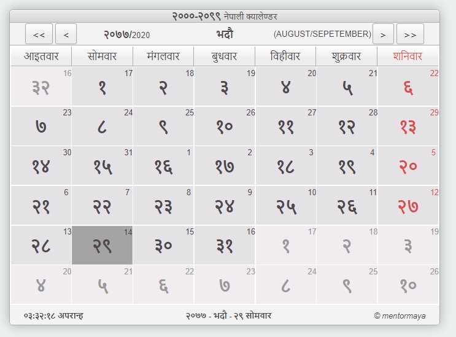

# Nepali Calendar JS Library :nepal:



## Descrition

This is the simple library for developers who wants a Nepali Calendar in there app with JS. The objective of this library is to provide a complete solution for the nepali calendar needs. Either that being need for calendar for UI design or may be its for datepicker. This library will also be usefull and provide an option to convert the dates back and forth in nepali and international calendar.

Using this library developers will be able to use the custom HTMLElement created with web components named as

```html
<nepali-calendar></nepali-calendar>
```

This component has also custom attributes that can be used as normal html elements and also it has its own custom event that is passed whenever user selects a date inside the calendar.

## Status : Calendar with UI and Events completed

This library is published with fully funtional calendar UI. Though i am deciding to add a datepicker for this.

### Progress

- [x] Initial setup
- [x] Documentation preparation
- [x] Planning the features
- [x] Workflow design
- [x] Implementation
- [] Upload to files to cdn
- [x] Update the README.md
- [x] Upload to GITHUB
- [] Adding a Datepicker functionality

## Download and Installation

This library is purely HTML, CSS and Vanilla JS based that's why doesnot need any special installation.

All you need is to download the library file from this repo by either downloading a ZIP version or by command using git clone as

```bash
git clone https://github.com/mentormaya/Nepali-Calendar-Web-Component.git
```

and place the file inside the library or js folder of your project and include this in your html document and you are all set.

## Usage

This library is very simple to use.

All you need to do is just import it in to your HTML document as

```html
<script src="path-to-file/file.js"></script>
```

and you are all set. You can go a head and create a nepali calendar with the custom component provided by this library.

```html
<nepali-calendar></nepali-calendar>
```

A demo _index.html_ file is included in the project directory that also explains the usage.

You can also use your own calendar title with the slot named _title_ provided where you can use any HTML Typography based elements as

```html
<nepali-calendar style="src/nepali-calendar-1.0.0-min.css" lang="nep">
  <div slot="title">
    <strong>२०००-२०९९</strong>
    <small>नेपाली क्यालेण्डर</small>
  </div>
</nepali-calendar>
```

Also the stylesheet of the Calendar UI is seperated from the library to make it easy for the customization. Althought the css is seperately passed with the attribute value its property are still binded to the calendar and its internal elements and encapsulated within the calendar shadow DOM.

```html
<nepali-calendar style="src/nepali-calendar-1.0.0-min.css" lang="eng">
  <div slot="title">
    <strong>२०००-२०९९</strong>
    <small>नेपाली क्यालेण्डर</small>
  </div>
</nepali-calendar>
```

Language can also be choosen with the lang attribute if you wish to display it in normal numbering or not in unicode based nepali style.

The date data from the selected date in the calendar can be obtained by adding an event listener to the nepali calendar object in your own project wherever required with js as

```html
<script>
  let dis = document.querySelector(".selected");
  const arrayOfWeekdays = [
    "Sunday",
    "Monday",
    "Tuesday",
    "Wednesday",
    "Thursday",
    "Friday",
    "Saturday",
  ];
  let calendar = document.querySelector("nepali-calendar");
  calendar.addEventListener("select", ({ detail }) => {
    dis.innerHTML =
      arrayOfWeekdays[detail.day - 1] +
      " " +
      detail.np +
      " BS & " +
      detail.int +
      " AD ";
  });
</script>
```

> Hope this projet will make you happy &hearts;
